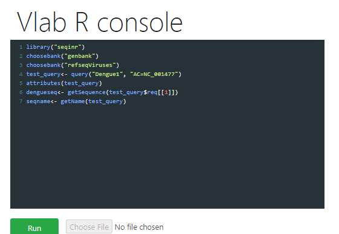

1.	Follow ( https://vlab.amrita.edu/index.php?sub=3&brch=311&sim=1835&cnt=2) to install R in personal computer.

2.	Install the SeqinR package.

3.	To load “SeqinR” R package follow > library("seqinr") 

4.	For retrieving a specific sequence with particular NCBI accession, use R function “getncbiseq()”.

&nbsp;
        > getncbiseq <- function(accession)
        {
        require("seqinr") # this function requires the SeqinR R package`


&nbsp;
first find which ACNUC database the accession is stored in:
    
        dbs <- c("genbank","refseq","refseqViruses","bacterial")
        numdbs <- length(dbs)
        for (i in 1:numdbs)
        {
        db <- dbs[i]
        choosebank(db)


check if the sequence is in ACNUC database 'db':

        resquery <- try(query(".tmpquery", paste("AC=", accession)), silent = TRUE)
        if (!(inherits(resquery, "try-error")))
        {
        queryname <- "query2"
        thequery <- paste("AC=",accession,sep="")
        query(`queryname`,`thequery`)

see if a sequence was retrieved:

        seq <- getSequence(query2$req[[1]])
        closebank()
        return(seq)
        }
        closebank()
        }
        print(paste("ERROR: accession",accession,"was not found"))
        }


&nbsp;

EXAMPLE
•	After entering function getncbiseq() into R, retrieve a sequence from the NCBI Nucleotide database, for example  accession NC_001477. 

•	Follow the code 

        > dengueseq <- getncbiseq("NC_001477")


•	 Dengueseq variable is a vector containing the nucleotide sequence


&nbsp;

Procedure to work the simulator


1.	Follow the code in the command window: 

```library("seqinr")  # Load seqinr package in R

choosebank("genbank") # ChossingGenBank for the sequence

choosebank("refseqViruses") # Choosing the sub database which we want to search

test_query<- query("Dengue1", "AC=NC_001477") # querying and setting the name and passing accession number

attributes(test_query) # for viewing the attriutes of query()

dengueseq<- getSequence(test_query$req[[1]]) # get the dna sequence

seqname<- getName(test_query)

#write.fasta(sequences = dengueseq, names = seqname, file.out="denguevirus.fasta")
```
 

&nbsp;
<center></center>
&nbsp;

<center>Fig.3. R console for querying NCBI database in R</center>


&nbsp;

2.	Click Execute Button for output.   


&nbsp;

**Note**

This experiment retrieves the sequence data directly from the NCBI database using R programming. Using the choosebank() function in the ‘seqinr’ library the R platform connects to the GenBank database. Using the R programming, user can retrieve and save the species specific sequence data in a variable.


